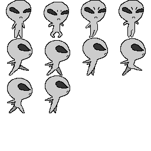

# Super-Cactus-Jump
 A spiritual successor to the Google Chrome classic.

# Implementations
This game is made using HTML and JavaScript, with the Phaser 3 plugin acting as the game engine.  
You can learn more about how Phaser 3 works [here](https://phaser.io/learn).  

# Tutorial Goals
The main goal of this tutorial is to teach users how to create reusable sprite animations for their own Phaser game.  
Users will be incouraged to create their own sprite sheets using Adobe Animate.  
Here's the sprite sheet we will be working with for this example:  
  
